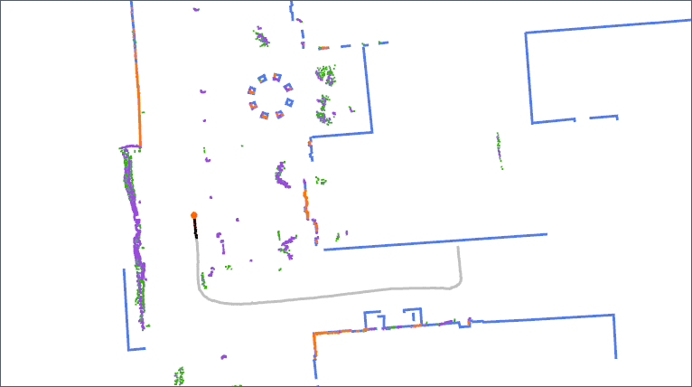

# Episodic non-Markov Localization

[](https://github.com/ut-amrl/enml/actions)

Implementation in C++ of Episodic non-Markov Localization [[pdf]](https://www.joydeepb.com/Publications/ras_episodic_nonmarkov_localization.pdf).
Please cite this work using the following bibtex:
```
@article{biswas2016episodic,
  author = { Joydeep Biswas and Manuela M. Veloso },
  url = { https://www.joydeepb.com/Publications/ras_episodic_nonmarkov_localization.pdf },
  doi = { 10.1016/j.robot.2016.09.005 },
  issn = { 0921-8890 },
  year = { 2017 },
  pages = { 162 - 176 },
  volume = { 87 },
  journal = { Robotics and Autonomous Systems  },
  title = { Episodic non-Markov localization },
}
```

## ROS Dependencies
1. [ROS](https://www.ros.org/)
1. [AMRL Maps](https://github.com/ut-amrl/amrl_maps)
1. [AMRL ROS Messages](https://github.com/ut-amrl/amrl_msgs)

## Compiling
1. Run `./InstallPackages` to install the dependencies on *ubuntu >=14.04 .
1. Add the working directory to the `ROS_PACKAGE_PATH` environment variable with:

   ```
    export ROS_PACKAGE_PATH=`pwd`:$ROS_PACKAGE_PATH
    ```
1. Install [amrl_msgs](https://github.com/ut-amrl/amrl_msgs) and add it to the `ROS_PACKAGE_PATH` variable.
1. Run `make`

## Configuration
Configuration files are written in Lua.
If `enml` is launched without any options, it will try to load the robot config
file `config/robot.lua`. There are several example robot configurations,
including `cobot.lua`, `ut_jackal.lua`, and `ut_automata.lua`. To specify a
different robot config file, use the `-r` flag:
```
./bin/enml -r ut_jackal.lua
```
The base configuration directory is assumed to be `config`, but it can be
overriden using the `-c` flag. For example:
```
./bin/enml -c ~/robot_config -r robot1.lua
```
This will load the `~/robot_config/robot1.lua` file. 

The robot configuration file defined the ROS topics to listen to, initialization
conditions, and EnML algorithm parameters.

## Usage

To run enml, simply run `./bin/enml`

### Visualization

While running, you may want to visualize what's going on. To do this, add the `-d1` flag to the run command, which will cause enml to publish visualization messages while running.

To see the resultant visualization, there are 2 options:
#### VectorDisplay
Obtain and setup the `ut-amrl/vector_display` repo.
Then run `./bin/vector_display`, optionally with the `map-name` parameter matching the map used for enml localization. This will automatically listen to the same topics `enml` is publishing, and you will see the visualization in the localization gui's window.

#### WebRViz
Obtain and setup the `ut-amrl/robofleet-deployment-server` repo.

Run the websocket `./bin/websocket`. 

Open the webrviz html file in browser, and connect to localhost. This will automatically listen to the same topics `enml` is publishing, and you will see the visualization in the web rviz's viewport.

## Example



1. Download the example ROS bag file of the UT-Jackal navigating from GDC to AHG: [2020-06-03-18-51-39.bag](https://drive.google.com/file/d/1GrQ3982jt0dSS8Yw0h-hxMvZXgpmObWY/view?usp=sharing)
1. Edit `config/robot.lua` to match the UT Jackal's configuration:
    ```
    RobotConfig = {
      name = "ut-jackal";
      scan_topic = "/scan";
      pointcloud_topic = "";
      odometry_topic = "/jackal_velocity_controller/odom";
      initialpose_topic = "/initialpose";
    };
    ```
1. Edit the `config/enml.lua` to set the initial pose in the `ut-jackal` section:
    ```
    ...
    if RobotConfig.name=="ut-jackal" then
      ...
      -- 2020-06-03-18-51-39.bag
      enml.map_name = "UT_Campus";
      enml.starting_loc_x = 131;
      enml.starting_loc_y = -245;
      enml.starting_angle = deg2rad(-85);
    ...
    ```
1. Run vector_display
1. Run Enml in offline bag replay mode with the example bag file:
    ```
    ./bin/enml -d1 -b 2020-06-03-18-51-39.bag
    ```
