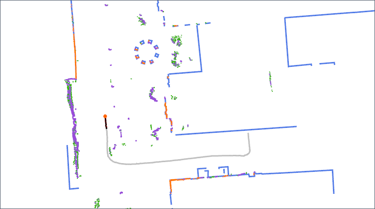

# Episodic non-Markov Localization

[](https://github.com/ut-amrl/enml/actions)

Implementation in C++ of Episodic non-Markov Localization [[pdf]](https://www.joydeepb.com/Publications/ras_episodic_nonmarkov_localization.pdf).
Please cite this work using the following bibtex:
```
@article{biswas2016episodic,
  author = { Joydeep Biswas and Manuela M. Veloso },
  url = { https://www.joydeepb.com/Publications/ras_episodic_nonmarkov_localization.pdf },
  doi = { 10.1016/j.robot.2016.09.005 },
  issn = { 0921-8890 },
  year = { 2017 },
  pages = { 162 - 176 },
  volume = { 87 },
  journal = { Robotics and Autonomous Systems  },
  title = { Episodic non-Markov localization },
}
```

## Dependencies
1. [ROS2](https://docs.ros.org/en/rolling/)
1. [AMRL Maps](https://github.com/ut-amrl/amrl_maps)
1. [AMRL Msgs](https://github.com/ut-amrl/amrl_msgs)

## Setup

1. **Clone this repository and initialize submodules:**
    ```bash
    git clone https://github.com/ut-amrl/enml.git
    cd enml
    git submodule update --init --recursive
    ```

2. **Add the install path to your `AMENT_PREFIX_PATH` in `~/.bashrc`:**
    ```bash
    echo "export AMENT_PREFIX_PATH=$(pwd)/install:\$AMENT_PREFIX_PATH" >> ~/.bashrc
    source ~/.bashrc
    ```

3. **Install dependencies:**
    ```bash
    ./InstallPackages
    ```

4. **Build and install:**
    ```bash
    make
    ```
    This will automatically build and install the package for ROS2. Binaries will be in `install/bin/`.

## Configuration
Configuration files are written in Lua.
If `enml` is launched without any options, it will try to load the robot config
file `config/robot.lua`. There are several example robot configurations,
including `cobot.lua`, `ut_jackal.lua`, and `ut_automata.lua`. To specify a
different robot config file, use the `-r` flag:
```bash
./bin/enml -r ut_jackal.lua
```
The base configuration directory is assumed to be `config`, but it can be
overriden using the `-c` flag. For example:
```bash
./bin/enml -c ~/robot_config -r robot1.lua
```
This will load the `~/robot_config/robot1.lua` file. 

The robot configuration file defines the ROS2 topics to listen to, initialization
conditions, and EnML algorithm parameters.

## Command-Line Flags

The `./bin/enml` executable supports the following command-line flags:

| Long Option         | Short | Argument Type | Description                                               |
|---------------------|-------|--------------|-----------------------------------------------------------|
| `--config_dir`      | `-c`  | STRING       | Config directory                                          |
| `--robot_config`    | `-r`  | STRING       | Robot configuration file                                  |
| `--maps_dir`        | `-m`  | STRING       | Maps directory                                            |
| `--debug`           | `-d`  | NUM (int)    | Debug/visualization level (e.g., `-d1` enables viz)       |
| `--bag-file`        | `-b`  | STRING       | ROS bagfile to use (for offline/bagfile mode)             |
| `--max-poses`       | `-n`  | NUM (int)    | Maximum number of laser poses to optimize                 |
| `--time-skip`       | `-s`  | NUM (double) | Time to skip from the bag file (in seconds)               |
| `--test-set`        | `-t`  | NUM (int)    | Test set index                                            |
| `--statistical-test`| `-T`  | NUM (int)    | Statistical test index                                    |
| `--noise`           | `-N`  | NUM (double) | Statistical test additive random noise                    |
| `--keyframes`       | `-k`  | STRING       | Keyframes file                                            |
| `--episode-images`  | `-e`  | STRING       | Episode images path                                       |
| `--unique_node_name`| `-u`  | NONE         | Use unique ROS node name                                  |
| `--initial_poses`   | `-i`  | NONE         | Return initial, instead of final, pose estimates          |
| `--disable-stfs`    | `-p`  | NONE         | Disable STFs (Short-Term Features)                        |
| `--save-ltfs`       | `-l`  | NONE         | Save LTFs (Long-Term Features)                            |
| `--quiet`           | `-q`  | NONE         | Quiet mode (suppress stdout)                              |
| `--rate`            | `-R`  | NUM (double) | Rate (in Hz) at which to run the bag file                 |
| `--help`            |       |              | Show help message                                         |

**Examples:**

- Run with a specific robot config and enable visualization:
  ```bash
  ./bin/enml -r ut_jackal.lua -d1
  ```
- Run offline on a ROS2 bag file, skipping the first 10 seconds:
  ```bash
  ./bin/enml -b mydata.db3 -s 10
  ```
- Specify a custom config and maps directory:
  ```bash
  ./bin/enml -c ~/robot_config -m ~/maps -r robot1.lua
  ```

## Usage

To run enml in ROS2, simply run:
```bash
# Source your ROS2 workspace first
source ~/ros2_ws/install/setup.bash
./bin/enml
```

### ROS2 Topics

**Subscribed Topics:**
- `/scan` (sensor_msgs/msg/LaserScan) - Laser scan data
- `/odom` (nav_msgs/msg/Odometry) - Odometry data  
- `/initialpose` (amrl_msgs/msg/Localization2DMsg) - Manual pose initialization

**Published Topics:**
- `/localization` (amrl_msgs/msg/Localization2DMsg) - Enhanced pose with map info
- `/localization_ros` (geometry_msgs/msg/PoseStamped) - Standard ROS2 pose
- `/visualization` (amrl_msgs/msg/VisualizationMsg) - Visualization data

### Visualization

While running, you may want to visualize what's going on. To do this, add the `-d1` flag to the run command, which will cause enml to publish visualization messages while running.

To see the resultant visualization, there are 2 options:

#### VectorDisplay
Obtain and setup the `ut-amrl/vector_display` repo.
Then run `./bin/vector_display`, optionally with the `map-name` parameter matching the map used for enml localization. This will automatically listen to the same topics `enml` is publishing, and you will see the visualization in the localization gui's window.

#### WebViz
Obtain and setup the `ut-amrl/webviz` repo.

Run the websocket `./bin/websocket`. 

Open the webviz html file in browser, and connect to localhost. This will automatically listen to the same topics `enml` is publishing, and you will see the visualization in the web viewport.

## ROS2 Bag File Processing

EnML supports offline processing of ROS2 bag files. Use the `-b` flag to specify a bag file:

```bash
./bin/enml -d1 -b your_bag_file.db3
```

**Note**: ROS2 bag files use the `.db3` extension (SQLite format) instead of ROS1's `.bag` format.

## Example



1. **Record ROS2 bag file**: Record a bag file with your robot or download an example ROS2 bag file.

2. **Configure robot parameters**: Edit `config/robot.lua` to match your robot's configuration:
    ```lua
    RobotConfig = {
      name = "your-robot";
      scan_topic = "/scan";
      pointcloud_topic = "";
      odometry_topic = "/odom";
      initialpose_topic = "/initialpose";
    };
    ```

3. **Set initial pose**: Edit the `config/enml.lua` to set the initial pose:
    ```lua
    if RobotConfig.name=="your-robot" then
      enml.map_name = "YourMap";
      enml.starting_loc_x = 0;
      enml.starting_loc_y = 0;
      enml.starting_angle = deg2rad(0);
    end
    ```

4. **Run vector_display**
5. **Run EnML with bag file**:
    ```bash
    # In terminal 2 - Run EnML in offline mode
    ./bin/enml -d1 -b your_bag_file.db3
    ```